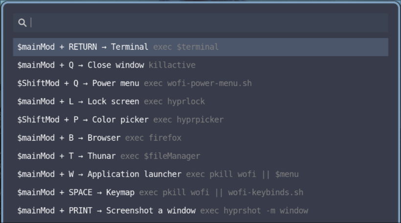

# wofi-hyprland-keybinds
Script to list Hyprland keybinds in Wofi.

This script provides a quick and efficient way for Hyprland users to access and execute keybindings defined in their Hyprland configuration file by Wofi.

This project is based on [rofi-hyprland-keybinds-cheatsheet](https://github.com/jason9075/rofi-hyprland-keybinds-cheatsheet).

## Preview

## Remarks
 - Include keybind discriptions in your Hyprland config as remarks to list them in Wofi. Example:
   
   `
   bind = $mainMod, Q, killactive #Close window
   ` 

- The script can list combined binding commands like:

  `
  bind = $mainMod, C, exec, hyprctl keyword general:layout "master" && hyprctl dispatch layoutmsg orientationcenter #Centered layout
  `

- To toggle the script by e.g. mainMod + space, include in your Hyprland config:
 
  `
  bind = $mainMod, SPACE, exec, pkill wofi || wofi-keybinds.sh #Keymap
  `
  (The script should be made executable by `chmod +x` and placed in a directory included in your `$PATH`.)
  
